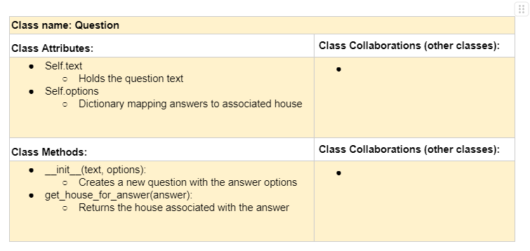
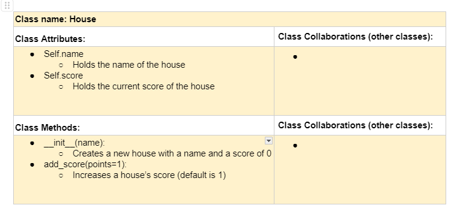
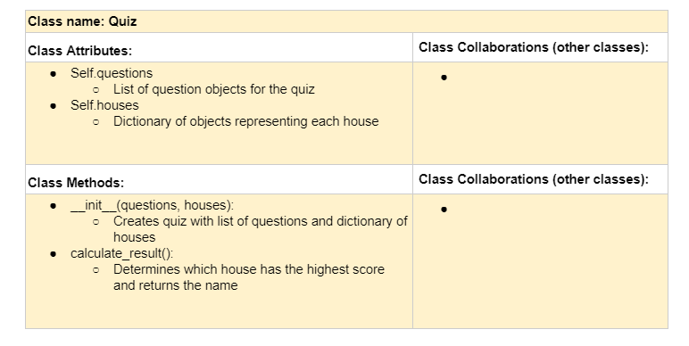
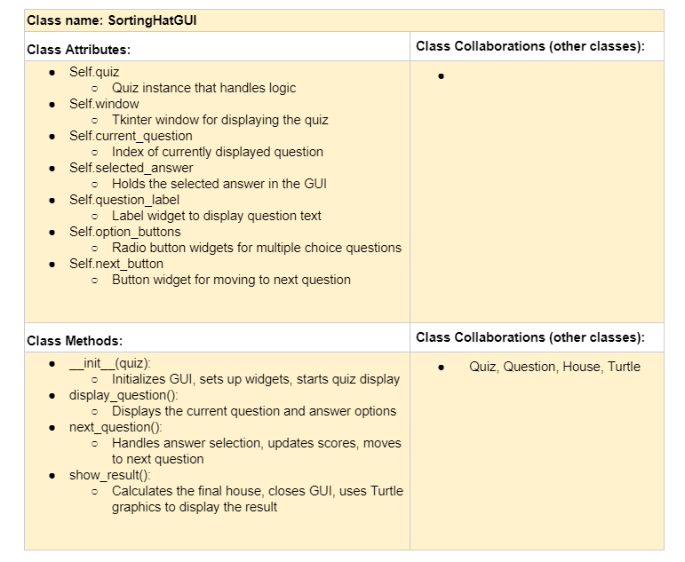

# Sorting Hat Quiz


**Author(s)**: Cody Bandy

**Google Doc Link**: https://docs.google.com/document/d/1hUkpndO_Y33dohdYFrD94r5aF0yBLR0EfFUOT2MJWuI/edit?usp=sharing

---

## References 


---

## Milestone 1: Setup, Planning, Design

**Title**: `Harry Potter Sorting Hat Quiz`

**Purpose**: `Ask the user multiple choice questions to determine a result, then use turtle drawing to display which house they belong to.`

**Source Assignment(s)**: `T01 (conditionals), T02/03 (turtles), T10 (classes), T12 (GUI)`

**CRC Card(s)**:
  





**Branches**:

```
    Branch 1 name: bandyc
    Branch 2 name: _____________
```
---

## Milestone 2: Code Setup and Issue Queue

Most importantly, keep your issue queue up to date, and focus on your code. 🙃

Reflect on what you’ve done so far. How’s it going? Are you feeling behind/ahead? What are you worried about? 
What has surprised you so far? Describe your general feelings. Be honest with yourself; this section is for you, not me.

```
    I would say I am about 50% done with the project overall. I feel I am on track to complete the project on time.
    I have a clear idea of where I need to do. I have most of the logic figured out, but I still need to figure
    out the specifics of the GUI to get it looking the way I want it to.
```

---

## Milestone 3: Virtual Check-In

Indicate what percentage of the project you have left to complete and how confident you feel. 

**Completion Percentage**: ``

❗️**Confidence**: Describe how confident you feel about completing this project, and why. Then, describe some 
  strategies you can employ to increase the likelihood that you'll be successful in completing this project 
  before the deadline.

```
    **Replace this text with your reflection
```

---

## Milestone 4: Final Code, Presentation, Demo

### ❗User Instructions
In a paragraph, explain how to use your program. Assume the user is starting just after they hit the "Run" button 
in PyCharm. 

### ❗Errors and Constraints
Every program has bugs or features that had to be scrapped for time. These bugs should be tracked in the issue queue. 
You should already have a few items in here from the prior weeks. Create a new issue for any undocumented errors and 
deficiencies that remain in your code. Bugs found that aren't acknowledged in the queue will be penalized.

### ❗Reflection
In three to four well-written paragraphs, address the following (at a minimum):
- Why did you select the project that you did?
- How closely did your final project reflect your initial design?
- What did you learn from this process?
- What was the hardest part of the final project?
- What would you do differently next time, knowing what you know now?
- (For partners) How well did you work with your partner? What made it go well? What made it challenging?